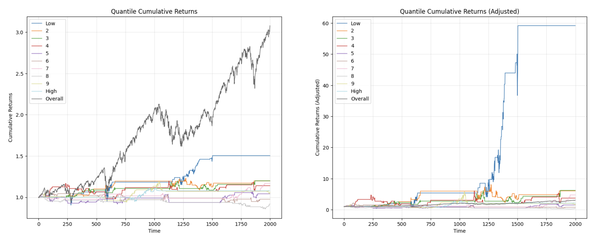
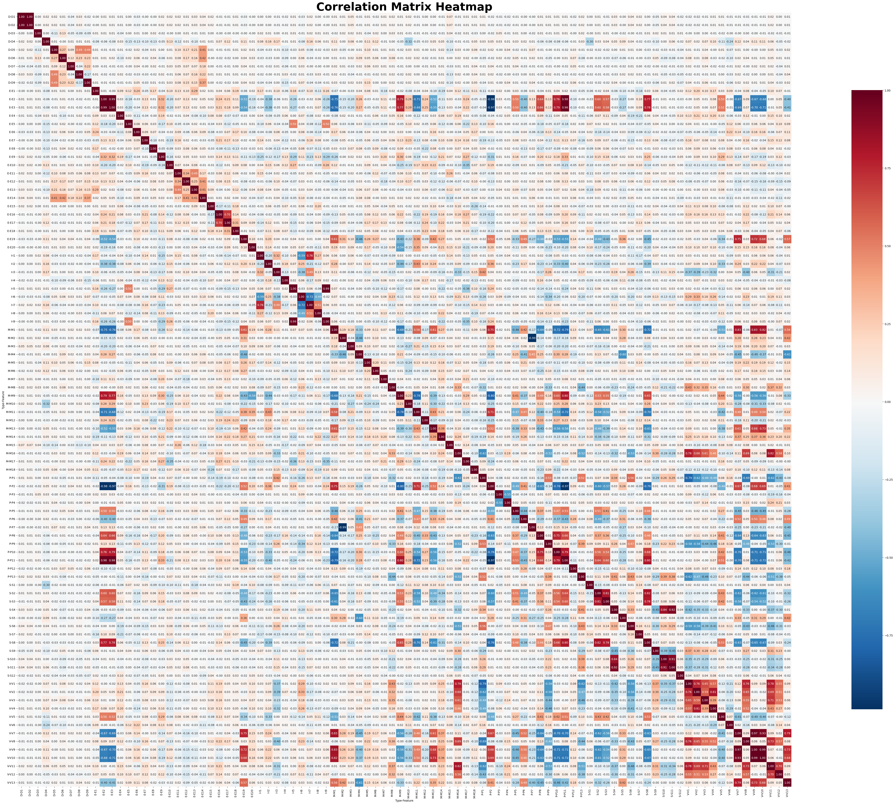
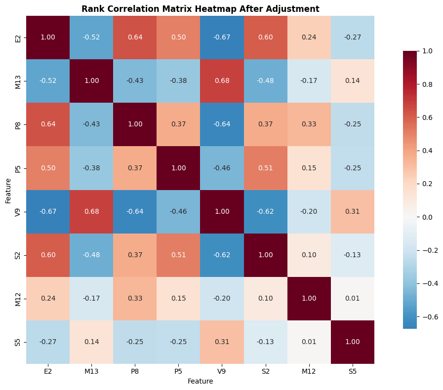

# feature 筛选流程

## 1. 计算 feature 各种指标

### 1.1. 滚动 IC IR RankIC RankIR
取固定滚动窗口，计算该窗口内 feature 值和 forward return 的相关性，计算均值得到 IC，计算稳定性得到 IR。通过绘制 Cumulative IC 和 Cumulative Rank IC 来初步判断因子与 forward return 的相关性是够高且稳定。

例如下图 E2 feature 的 Cumulative IC 和 Rank IC 均接近直线，说明该feature 的值可以很好的用于估计 forward return，

### 1.2. 分组收益
用 feature 值将时段分为从小到大的十组，分别计算只在单组内的时段交易的收益，并绘制分组累计收益曲线。

例如下图 E3 feature 的分组收益曲线，分组收益呈现较好的单调性，即 feature 值越高的时段对应的收益也越高，

### 1.3. feature 相关性
计算所有 feature 间的相关性，并绘制相关性矩阵热力图用于筛选低相关性的 feature，

## 2. 筛选

### 2.1. 选择效果好的 feature
结合 1.1 和 1.2 中的各项指标，手动筛选出表现较好（cumulative IC 呈直线，分组收益单调）的 feature，`["E2", "E3", "M1", "M9", "M11", "M13", "P2", "P5", "P8", "P10", "P11", "S2", "S3", "S8", "V7", "V9", "V10", "E19", "M12", "S5", "V13"]`

### 2.2. 筛选出低相关性 feature
绘制 2.1 筛选之后的相关性热力图，

先按照 IR 将筛选出的因子排序，对于相关性高于 0.7 的两个 feature，只选择表现较好的一个，得到低相关性 feature，`["E2", "M13", "P8", "P5", "V9", "S2", "M12", "S5"]`。热力图如下，
